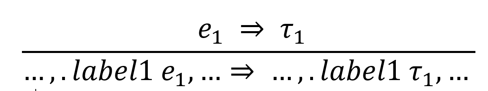
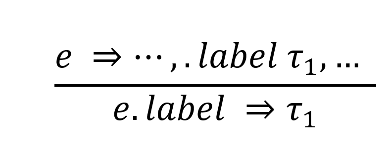
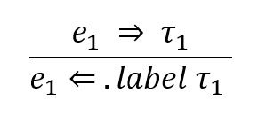
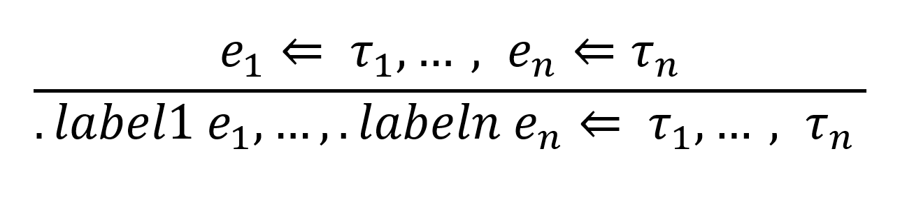

# Introduction

<!-- TODO: what are labeled products -->
Labeled products are a type of value. They are similar to products, but some or all elements have a label. The label is used with projection. This allows elements within the product to be accessed either positionally or by the label. 
<!-- TODO: why do we want them in Hazel -->
Adding labeled products helps with readability of products, so more complex products can be easily used within Hazel. Remembering the positions of values in along product may be difficult, so labels allow for easy access of values in a product. The labeled products serve a similar purpose as records in other languages.
<!-- TODO: what do we have now -->
Currently only unlabeled tuples are supported in Hazel, and elements can only be accessed positionally using pattern matching (via let or case).

# Label Syntax
Say what the regex for labels are
Say it's the same syntax for variable identifyers (ie no spaces)
Say that the dot is used

# Labeled Product Types
<!-- Syntax: `.label1 ty1, .label2 ty2, ..., .labeln tyn` -->

Files to Edit: UHTyp.re
<!-- TODO: add `.label` as a new type form <br/> -->
<!-- TODO: List the files you expect ot edit for each thing, and a sentance about what you expect to do -->
<!-- Just add space operator, check UHExp.re for this -->
<!-- Look at Skeltype parser and see that there is something that determines prescedence,-->
<!-- Stat that we are not requiring parenthesis-->

To add labeled product types, the operator and opearnd types will need to be expanded like so:
```
type operator =
...
 | Space; 
```
<!-- For space, say if left or right associative and give presedence-->
Space will be left associateive and have the highest precedence. 
```
type operand =
...
 | Label(Label.t);                  //.label
```

<!-- TODO: do we want to allow partially labeled product types? -->
Partially labeled product types are allowed, and labels and non-labeled positions can be interleaved.
For example, the labeled product type `(.x Num, Num, .y Num)` is allowed. 

Singleton label products are supported. For example, `.x Num` is supported.

## Type Equivalence

A labeled product may still be used with positional arguments, so the type equivalence considers the order of the labels with equlivalence. For example, `(.x Num, .y Num, .z Num) != (.z Num, .y Num, .x Num)` because the order of the labels is different.

## Type Syntax Errors
Files to Edit: CursorInfo.re

* A label must be followed by a valid type and comma operator, not another label. For example, `.label1 .label2 ty` produces an error.
 * Error Cursor appears on `.label2`
 * Expecting a Type Got a Label

* A label cannot exist by itself; it is given meaning by having a type follow it. For example, `.label1 ` by itself produces an error. 
 * Error Cursor appears on `.label1`
 * Message: Expecting a Type Got a Label

* Elements in the tuples need to be separated by commas, if they are not then this produces an error. For example, `.label1 ty .label2` produces an error. 
 * Error cursor appears on space operator
 * Message: Expecting ? Got an Unexpected Label

* Duplicate labels within a tuple are not valid, so they produce an error. The error will appear on the subsequent duplicate uses, not on the type as a whole. FOr example, the type `.label1 Num, .label1 Num, .label2 Num, .label1 Bool` will have errors on the second use of `.label1 Num` and `.label1 Bool`
 * Error Cursor appears on second and third use of `.label1`<br/>
 * Expecting a Unique Label Got a Duplicate Label

# Expressions
<!-- TODO: add `.label` as a new expression form -->
Both label tuple expressions and projection expressions must be added to Hazel to implement labeled tuples.
## Labeled Tuples

Files to Edit: UHExp.re

To add labeled tuples, the operand type must be expanded to include labels.
```
operand =
 ...
 | Label(Label.t)           //.label
 ```
<!-- TODO: similar considerations as above -->

Partially labeled product expressions are allowed, and labels and non-labeled positions can be interleaved.
For example, the labeled product expression `(.x 2, 3, .y True)` is allowed. 

Singleton label product expressions are supported. For example, `.x 2` is supported.

<!-- TODO: can you omit labels by providing values in order: `(1, 2, 3) <= (.x Num, .y Num, .z Num)` -->
An unlabeled product expression can analyze to a labeled product expression, allowing you to omit labels. For example, `(1, 2, 3) <= (.x Num, .y Num, .z Num)` is valid and each value in `(1,2,3)`. This operation happens positionally, and does not assign labels based on variable name if variables are used. For example, `(y, x, z) <= (.x Num, .y Num, .z Num)` is valid. 

<!-- 
TODO: "Record punning" in Reason: `{x, y, z} => {x: x, y: y, z: z}` -- is there anything analogous that we can do? Does this interact with positional values? `(y, x, z) <= (.x Num, .y Num, .z Num)` does that operate positionally or via punning?
TODO: partially labeled values, where some of the arguments are in order: `(1, 2, .z 3) <= (.x Num, .y Num, .z Num)`. what about interleaving vs. requiring all the explicit labels at the end ala Python?
TODO: what are the type synthesis and type analysis rules for the labeled tuple expressions -->
### Punning
Some languages, such as Reason, have record punning. This is where a record's labels can be implied when it is declared using variables. For example, `{x, y, z} => {x: x, y: y, z: z}` is true. Similar punning fuctionality could be implemented in Hazel. For example, if this punning was implemented `(x, y, z) => (x: x, y: y, z: z)` would hold true. However, this creates a question of if every tuple created with variables should be a labeled tuple. Given this additional complexity and added development costs, I believe that labeled tuple punning should be considered out of scope for labeled tuples. 

## Projection 

Files to Edit: UHExp.re

Labels can be used to access elements of a pair through projection expressions. To add projection, the operand type must be extended to include projection.
```
operand =
 ...
 | Prj(UHExp.t, Label.t)            // e.label
 ```

`e.label` will be the new expression form. `e.label` expects `e` to synthesize to a labeled tuple type and `label` to match one of the labels within `e`. 

`e.label` will return the value that has the label `label`.

## Type Sythesis and Type Analysis Rules for Labeled Product Expressions
### Synthesis




### Analysis



## Expression Syntax Errors
Files to Edit: CursorInfo.re

+ A label must be followed by a valid expression and comma operator, not another label. For example, `.label1 .label2 e` produces an error.
 + Proposed Error Message: Error Cursor appears on `.label2`
 + Message: Expecting an Expression Got a Label

+ A label cannot exist by itself; it is given meaning by having an expression follow it. For example, `.label1 ` by itself produces an error.
 + Error Cursor appears on `.label1`<br/>
 + Message: Expecting an Expression Got a Label

+ Elements in the tuples need to be separated by commas, if they are not then this produces an error. For example, `.label1 e1 .label2` produces an error. 
 + Error cursor appears on space operator<br/>
 + Message: Expecting Comma or Other Type Operator Got an Unexpected Label

+ Duplicate labels within a tuple are not valid, so they produce an error. The error will appear on the subsequent duplicate uses, not on the type as a whole. For example, `.label1 1, .label1 3, .label2 4, .label1 True` will produce an error.
 + Error cursor appears on second and third use of `.label1`<br/>
 + Message: Expecting a Unique Label Got a Duplicate Label

+ Using the dot operator as a binary operator on a type that is not a labeled tuple will produce an error. This error will appear on the expression to the left of the dot operator that is not a labeled product. For example, the expression `1.label1` will produce an error
 + Error cursor appears on`1`
 + Message: Expecting a Labeled Product Got a Num

# Labeled Tuple Patterns
Syntax: `.label1 p1, .label2 p2, ..., .labeln pn`

Files to Edit: UHPat.re

To add labeled tuples, the operand type must be expanded to include labels.

```
and operand =
 ...
 | Label(LabelErrStatus.t, string)          .label
```
<!-- TODO: similar considerations to labeled tuple expressions -->
Partially labeled product patterns are allowed, and labels and non-labeled positions can be interleaved.
For example, the labeled product type `(.x p1, p2, .y p3)` is allowed. 

Singleton label products are supported. For example, `.x p1` is supported.

## Synthesis and Analysis
<!-- TODO: can you omit labels by providing values in order: `(1, 2, 3) <= (.x Num, .y Num, .z Num)` -->
An unlabeled product pattern can match to a labeled product expression, allowing you to ommit labels. For example, `(.x 1, .y 2, .z 3)` can match on the pattern `(a, b, c)`. This operation happens positionally.

A labeled tuple pattern must match the label names and the order of a labeled tuple expression for a pattern match. For example, `(.x a, .y b, .z c)` will match with `(.x 1, .y 2, .z 3)` but will not match with `(.y 1, .z 2, .x 3)` because the order does not match.

A partially labeled pattern can match with a fully labled expression as long as the labels that do exist match. For example, `(.x 1, .y 2, .z 3)` will match on `(.x p1, p2, .z p3)`

## Punning
Punning may be useful for labeled tuple patterns, where the label can be used to access the element rather than adding an aditional variable. For example, with punning this code snippit:

```
let f = fun(.x, .y)
...
f(.x 1, .y 2)
```

would be equivalent to 

```
let f = fun(.x x, .y y)
...
f(.x 1, .y 2)
```

This would be a great quality of life improvement to patterns with labeled tuples, and will be attempeted with the initial implementation of labeled tuples. It will be considered lower priority, since it is not required for labeled tuples patterns to function at a basic level.

## Pattern Syntax Errors
Files to Edit: CursorInfo.re

+ Multiple labels must be followed by the comma operator, not another label. For example, `.label1 .label2` produces an error.<br/>
 + Error cursor appears on `.label2`
 + Message: Expecting a Pattern Got a Label

+ Elements in the tuples need to be separated by commas, if they are not then this produces an error. For example, `.label1 p1 .label2 p2` produces an error. <br/>
 + Error cursor appears on space operator <br/>
 + Message: Expecting Comma or other Expression Operator Got an Unexpected Label

+ Duplicate labels within a tuple are not valid, so they produce an error. The error will appear on the subsequent duplicate uses, not on the type as a whole. For example, `.label1 p1, .label1 p2, .label2 p3, .label1 p4` produces an error.
 + Error cursor appears on second and third use of `.label1`<br/>
 + Message: Expecting a Unique Label Got a Duplicate Label

# Action Semantics
## Create
Adding a dot by itself should imply that a label is being created. `.` will get to `.(Label Hole)`

## Delete
You can press backspace on `e |.label` and get to `e.label`

You can press space on `e|.label` and get to `e .label`

# What About Records? 
Records in other languages are very similar to the labeled tuples in this propoasal. Records are typically a data structure that bundles data together with labels and values, and the values are accessed using projection with the labels. The values are unordered in a record, while the values are ordered in a labeled tuple. A labeled tuple is able to perform the same functions as a record, while adding additional functionality by ordering data. If labeled tuples are sucessfully added to Hazel, then records will be redundant in Hazel.

# Appendix: Other Ideas
While creating this proposal, I considered many other ideas for Hazel labels. These ideas are detailed below.

## Reason Like ~label Annotations
Types: `~label1: ty1, ~label2: ty2, ... , ~labeln: tyn`

Expressions: `~label1: ty1, ~label2: ty2, ... , ~labeln: tyn`

Patterns: `~label: ty1, ~label: ty2, ... , ~labeln: tyn`

This was very similar to the final dot notation used. However, the dot operator was chosen over the tilda operator. This is because the tilda key is harder to acces than the dot on a keyboard, and the dot operator was already associated with projection.  It made more sense to associate the dot operator with label annotations rather than the tilda operator.

## Space Separator with No Label Annotations
Types: `label1 ty1, label2 ty2, ... , labeln tyn`

Expressions: `label1 e1, label2: e2, ... , labeln: en`

Patterns: `label1 p1, label2 p2, ..., labeln pn`

This suggestion reduces the number of additional operators needed for labled products. However, there is no way to tell distinction between undefined function variable application and labeled expression, so this syntax would not work.

## Colon Operator
Types: `label1: ty1, label2: ty2, ..., labeln: tyn`

Expressions: `label1: e1, label2: e2, ..., labeln: en`

Patterns: `label1: p1, label2: p2, ..., labeln: pn`

This syntax imitates many other languages, which use a colon operator to separate labels and values in record types. However, this creates onfusion between labeled pair type annotation and type annotations as they both would use the colon operator. For this reason, this option was not used.

## Colons and Braces 
Types: `{label1: ty1, label2:ty2, ..., labeln:tyn}`

Expressions: `{label1: e1, label2:e2, ..., labeln:e2}`

Patterns: `{label1: p1, label2: p2, ..., labeln: pn}`

This syntax is more typical for a record. This may create confusion about labeled tuples using positional arguments and records typically being unordered. In addition, adding logic for braces within Hazel would increase implementation complexity a great deal compared to the final dot notation discussed in this proposal.