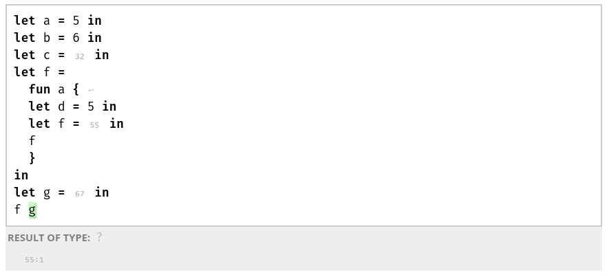
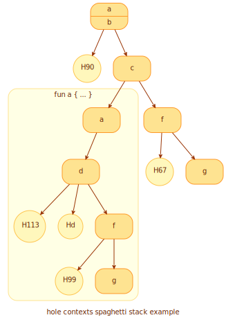
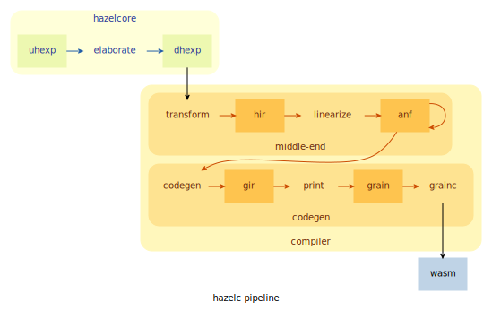

# PHI 14: Hazel Compiler

## Motivation

Right now, Hazel has only a simple evaluator, but not a compiler that can output fast, optimized,
cross-platform executables. This PHI proposes such a compiler.

This comes as a two-step process in implementation:

1.  The compilation of [complete programs](#complete-programs).
2.  The compilation of [*incomplete* programs](#incomplete-programs).

## Overview

The compiler will be based on [Grain](https://grain-lang.org/), a functional programming language
that compiles to [WebAssembly](https://webassembly.org/).

### Why Grain?

Grain, being a functional programming language itself, possesses features that allow for relatively
easy translation from Hazel code, such as pattern matching and garbage collection. Crucially, it
also targets WebAssembly.

### Why WebAssembly?

Though designed for running native-speed programs in the web, WebAssembly is portable open standard
that aims to support any operating system or execution environment. There are already a number of
runtimes targeting server or desktop environments, such as
[wasmer](https://github.com/wasmerio/wasmer) and
[wasmtime](https://github.com/bytecodealliance/wasmtime). By targeting WebAssembly, Hazel can take
advantage of these and run in a variety of different environments.

## Implementation

### Complete programs

Complete Hazel programs will be compiled directly into Grain's primitives and require no extra
machinery to execute.

#### Unresolved issues

Due to some of Grain limitations, there are some cases of complete programs that it cannot handle,
such as pattern matching with number/boolean literal patterns.

### Incomplete programs

For incomplete programs, the compiler will embed code to construct the syntax trees of indeterminate
forms during runtime.

This is done by writing a separate `Hazel` module that will be linked to during Grain compilation.
As opposed to directly calling Grain's primitive operators, we will mask these with functions that
will check for indeterminate expressions (see [below](#memory-representation)).

In the future, optimizations in code generation will allow for the direct application of Grain's
primitive operators when it is guaranteed that a sub-expression has no holes.

There remain many unsolved problems in this area, namely GC integration and pattern matching.

#### Memory representation

Grain currently has [three types of stack
values](https://github.com/grain-lang/grain/blob/main/docs/contributor/data_representations.md):
simple numbers, pointers (to heap values), and constants. Except for simple numbers, whose least
significant bit is always `1`, these stack values are tagged using the three least significant bits,
where `000` indicates a pointer, `010` indicates a stack-allocated character, and `110` indicates a
constant. Left as "reserved" is the tag `100`.

We will use the tag `010` to represent *pointers to indeterminate expressions* that live on the heap
as syntax trees. The syntax tree will be represented by an `enum` type similar to `DHExp.t`. The
`Hazel` module's functions will manually examine value's tag and perform the correct operation
accordingly.

#### Casts

During execution, casting will be performed via proxy functions that check types. That is, a cast on
some expression `d` from `t1` to `t2` will compile into

``` ocaml
(fun () -> { (* perform casting *) })()
```

In the future, we will switch to coercions à la [Grift](https://github.com/Gradual-Typing/Grift).

#### Hole contexts

During execution, like in the evaluator, the variable context for each hole must be maintained. We
will use a spaghetti stack, branching whenever hole or lambda expressions are encountered. A
separate table of hole identifiers and stack nodes will be kept for lookup.

As an example, consider the following Hazel code:



During execution, the following tree would be constructed:



The variable context of a hole consists of all identifiers in ancestor nodes. Hole 90, for example,
has `a` and `b`, but not `c`, in scope; and hole 67's context contains `a`, `b`, `c`, and `f`, but
not `g`. We must also respect binding scopes for lambdas; hole 67 does not contain any variables
inside the lambda expression.

Note that during execution, the sub-tree representing the lambda expression will only be constructed
when it is actually executed (i.e. when `f` is applied to `g` in the final line). Thus, we also must
keep track of where function contexts will branch from; when the lambda expression is first
encountered in the binding for `f`, the current node will remembered.

Though holes have been drawn here as separate nodes, in actual execution, a separate table in which
hole identifiers are paired with stack nodes would be maintained (e.g. for hole 90, the table entry
would point to the root node).

#### Pattern matching

This is still an unresolved question.

### Architecture

The compilation pipeline consists of a few separate stages.



#### `transform` : high-level transformation

The elaborated DHExp is converted into a similar high-level intermediate representation with a
number of transformations:

-   Recursive functions are resolved
-   Casts are converted to proxy functions (this may be changed)
-   Non-indeterminate sub-expressions use primitive operations

#### `linearize` : linearization

Linearization converts the high-level intermediate representation into linearised ANF. On this form,
optimizations may be performed in the future, if desired.

#### `codegen` : code generation

Finally, the ANF program is compiled into WebAssembly via a back-end code generator.

For now, the only back-end code generator is one that emits Grain and shells-out to the Grain
compiler: a straight-forward conversion transforms ANF into an IR form that mimics a subset of
Grain. Following pretty printing, `grainc` is called to produce a wasm executable.

## Progress

-   [ ] Complete programs
    -   [ ] case expression with number or boolean literal patterns
-   [ ] Incomplete programs
    -   [ ] Hole contexts
    -   [ ] Cast handling
    -   [ ] Pattern matching with holes
-   [ ] Program analysis and optimization
