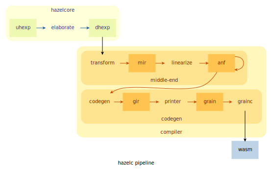

## Motivation

Right now, Hazel has only a simple evaluator, but not a compiler that can output fast, optimized,
cross-platform executables. This PHI proposes such a compiler.

This comes as a two-step process in implementation:

1.  The compilation of [complete programs](#complete-programs).
2.  The compilation of [*incomplete* programs](#incomplete-programs).

## Overview

The compiler will be based on [Grain](https://grain-lang.org/), a functional programming language
that compiles to [WebAssembly](https://webassembly.org/).

The compilation pipeline begins at the existing elaborator, which produces Hazel's internal
expression language. The resultant DHExp is passed to the compiler and translated into a Grain
module, which is in-turn compiled into WebAssembly by the Grain compiler.

### Why Grain?

Grain, being a functional programming language itself, possesses features that allow for relatively
easy translation from Hazel code, such as pattern matching and garbage collection. Crucially, it
also targets WebAssembly.

### Why WebAssembly?

Though designed for running native-speed programs in the web, WebAssembly is portable open standard
that aims to support any operating system or execution environment. There are already a number of
runtimes targeting server or desktop environments, such as
[wasmer](https://github.com/wasmerio/wasmer) and
[wasmtime](https://github.com/bytecodealliance/wasmtime). By targeting WebAssembly, Hazel can take
advantage of these and run in a variety of different environments.

## Implementation

### Complete Programs

Complete Hazel programs will be compiled directly into Grain's primitives.

Due to some of Grain limitations, there are some cases of complete programs that it cannot handle,
such as pattern matching with number/boolean literal patterns.

### Incomplete Programs

For incomplete programs, the compiler will embed code to construct the syntax trees of indeterminate
forms during runtime.

This is done by writing a separate `Hazel` module that will be linked to during Grain compilation.
As opposed to directly calling Grain's primitive operators, we will mask these with functions that
will check for indeterminate expressions (see [below](#memory-representation)).

In the future, optimizations in code generation will allow for the direct application of Grain's
primitive operators when it is guaranteed that a sub-expression has no holes.

There remain many unsolved problems in this area.

#### Memory Representation

Grain currently has [three types of stack
values](https://github.com/grain-lang/grain/blob/main/docs/contributor/data_representations.md):
simple numbers, pointers (to heap values), and constants. Except for simple numbers, whose least
significant bit is always `1`, these stack values are tagged using the three least significant bits,
where `000` indicates a pointer, and `110` indicates a constant. Left as "reserved" are the tags
`010` and `100`.

We will use the tag `010` to represent *pointers to indeterminate expressions* that live on the heap
as syntax trees. The syntax tree will be represented by an `enum` type similar to `DHExp.t`. The
`Hazel` module's functions will manually examine value's tag and perform the correct operation
accordingly.

#### Example

TODO

## Progress

-   [ ] Complete programs
    -   [ ] `case` expression with number or boolean literal patterns
-   [ ] Incomplete programs
    -   [ ] Empty/non-empty holes
        -   [ ] Basic dynamics
        -   [ ] Context
    -   [ ] Gradual typing
    -   [ ] Pattern matching
-   [ ] Program analysis and optimization
