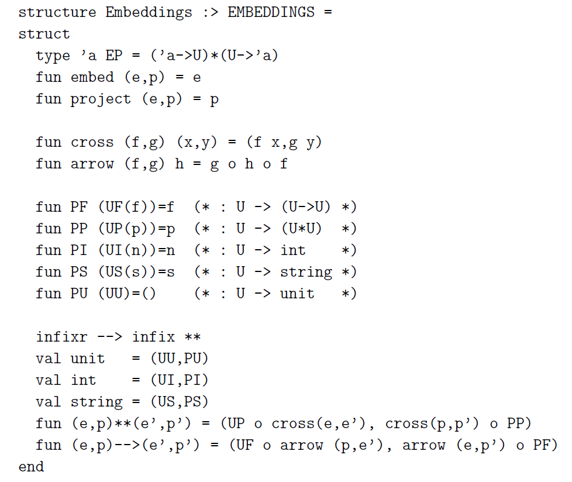

# Embedded Interpreters

Author: Nick Benton

## Main Contributions

- The paper introduces the type-directed embedding technique to implement interpreters into **statically-typed functional language**.
- It discusses how this technique can be extended to languages with with recursive types and basic meta-programming features.
- The paper also shows how the method combines with Filinski’s continuation-based monadic reflection operations to define a extended version of CBV monadic translation, enabling values to be mapped bi-directionally between the levels of an interpreters for a functional language parameterized by an arbitrary monad.

## Takeaways

### Popular Ways of Embedding

- for cases like Jython, Rhino and JScript(to .Net VM), the glue between the interpreting and interpreted languages is provided by the underlying execution engines support for dynamic types and reflection.
- for cases like some DSLs in Scheme, the distinction between languages is blurred by the host language (higher-order languages like) Scheme’s features such as higher-order functions and powerful macro facilities.
- in these cases(noted as “shallow embedding”), there’re many drawbacks...
    - the interpreted language is pretty much restricted to the host languages’ syntax and semantics. E.g. with these we cannot embed a dynamically-typed language into a host language with only static binding.
    - it’s hard to produce informative error messages.

### Embedding/ Projection Pairs

### To be continued...
