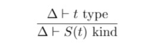
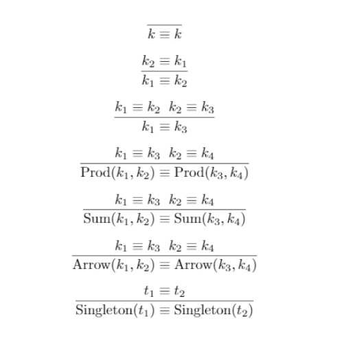

[TODO: type equivalence, type variable, cursor inspector and pretty printer]: # 

# Motivation

**Type aliases** give users ability to define a shorthand for another type, which is either a user defined type or primitive type. As for benefits, type aliases can reduce the amount of typing as well as increasing the readability of code. 

Moreover, most of popular programming languages provide this feature such as `typedef` in C/C++ and [type synonym](https://wiki.haskell.org/Type_synonym) feature in Haskell. 

# Overview
To be able to define type aliases, first we need to introduce a **kind system** to classify type constructors including the singleton kind which is used to express the type aliases. Second, we need to be able to construct **type variables** to stand for some type.

Moreover, new error messages for cursor inspector is needed. For the pretty printer, we also need to support the new syntax.

# Proposed Changes
## Pattern Language
Need to add support for type pattern, see [proposal 3](https://github.com/hazelgrove/phi/blob/3-explicit-polymorphism/3-explicit-polymorphism/3-explicit-polymorphism.md).

## Type-Level Language
### Type Variables

To support type alias, first we need to support type variable in our type level language.

Files to change :
   * `UHTyp.re` : add support for type variable
   * `HTyp.re` :  add support for type variable
   * We need to support type variable context Delta which is used to which variable is of which kind (v : k).
   * `Action.re` : be able to construct and use type variable 

#### `HTyp.re` : 

[TODO: propose the change to HTyp.t (see polymorphism branch, Charles Chamberlain)]: #

We will use de Bruijn indices to represent a type variable, which is the same for current [polymorphism branch](https://github.com/hazelgrove/hazel/blob/polymorphism/src/semantics/HTyp.re).

      type t ::= ...
               | TVar(idx, Var.t) /* bounded type variable */
               | TVarHole(Meta.t, Var.t) /* free type variable */

#### `UHTyp.re` :
TODO: propose the change to UHTyp.t (make sure you consider invalid type variables)

    TODO: writing down the kinding rules for kind inconsistencies and invalid type variables

#### `Action.re` :
TODO: how will Action module change

## Singleton Kind System
*The reference of this part is [PFPL 2nd edition](https://www.cs.cmu.edu/~rwh/pfpl/2nded.pdf) chapter 18 and chapter 43.*

File to change:
   * `HKind.re`

Here we introduce a kind system for Hazel:

    type t ::= Type
             | Hole
             | Unit
             | Prod(k, k)
             | Arrow(k, k)
             | Sum(k, k)
             | Singleton(HTyp.t)

We use `Type` to classify Bool, Int, Float and use `Hole` to classify Hole. For algebraic type, we use `Unit` and `Prod` to classify the product type and unit type and use `Sum` to classify sum type. Finally, we use `Singleton` kind to express type alias for type constructor `t`.

Note: ask if it's possible to use `Prod(list(k))` for implementation of kind by considering the current implementation of `HTyp.re`.

### Kind formation

Since the `Singleton` kind is a dependent kind, it is a valid kind when its argument is a valid type, thus the rule is given by 

### Kind Equivalence
Kind equivalence will be reflective, symmetric, transitive and closed under kind formation. Also, two singleton kind are equivalent at kind level if their arguments types are consistent at type level. The rules for kind equivalence are given below:

## Expression Language
   Files to change:
   * `UHExp.re` : add line item
   * `ZExp.re` : add line item
### `UHExp.re` :
To support type alias, we need to add a new line item to the language and the proposed syntax is 

`DefLine(TPat.t, UHTyp.t)` for abstract syntax

`define t is type in e`  for GUI syntax

### `ZExp.re` :
By considering the cursor positions of `DefLine`, we need to add two more zline items which are

`DefLineT(TPat.t, ZTyp.t)` (when cursor is on the type)

`DefLineP(ZTPat.t, UHTyp.t)` (when cursor is on the type pattern)

### Semantics
The static semantics of this expression is that type variable `t` will be classified as `S(type)` in the type variable context. The result is `t` will be definitionally equivalent to `type` in expression `e`.

## Dynamic Semantics
The dynamic semantics will not be changes, the type checking for the singleton kind is performed at static time.

## User Interface
### Key Bindings

#### Files to change:
* `ExpandingKeyword.re` : add a new keyword 
* `Actionre.re` : add new shape

For the keyboard interactions, we will handle the construct of the `DefLine` the same way as the `LetLine`. As a result, when cursor is at a place where expression is expected, if user type "define" and then hit space, we will expand the line to an `DefLine`.

#### `ExpandingKeyword.re` :
1. For `ExpandingKeyword.t`, we need to add define keyword

        type t = ...
           | Define
2. Update other functions accordingly

#### `Action.re` :
1. For `Action.shape`, we need to add new shape define

        type shape = ...
                   | SDefine

2. Update other functions and utilities.

### Cursor Inspector
TODO: adding new error messages for kind inconsistencies and invalid type variables

### Pretty Printer
TODO: adding support for new constructs
